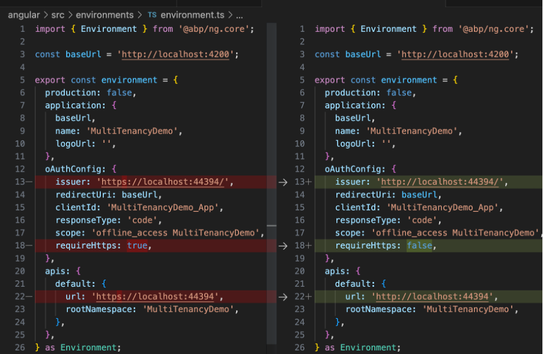
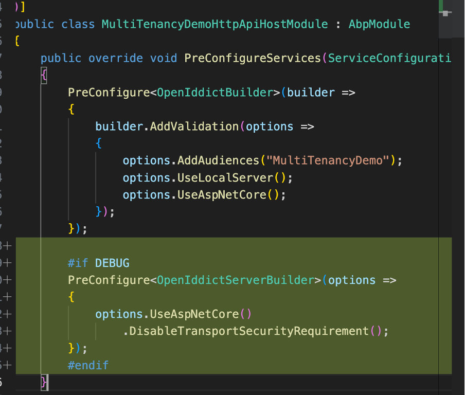
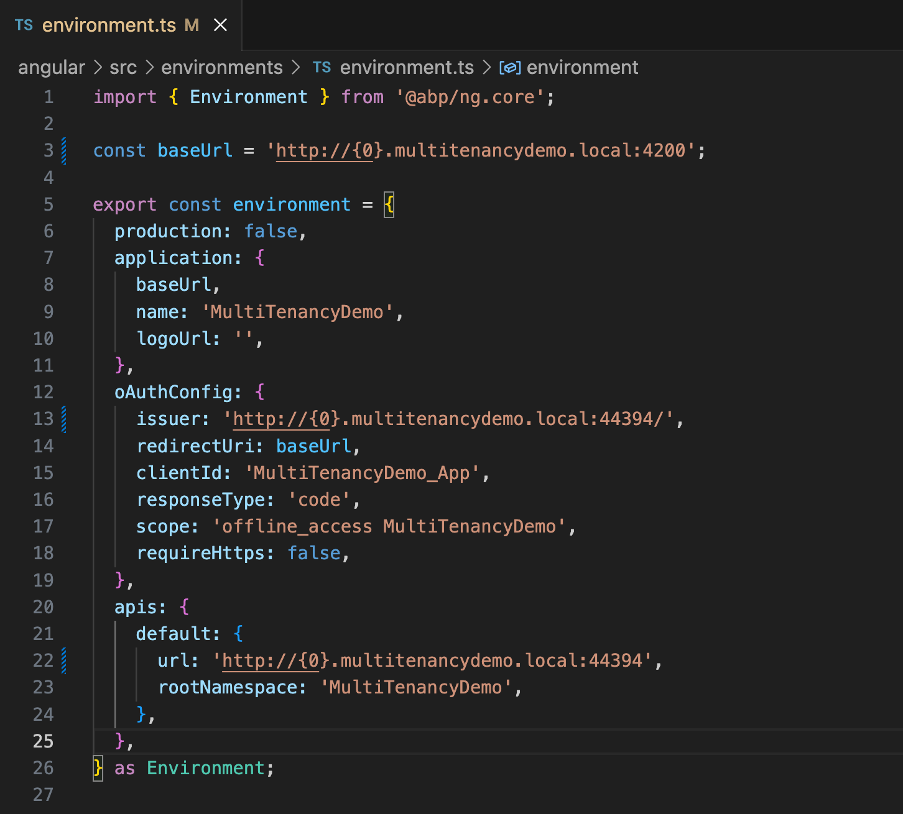
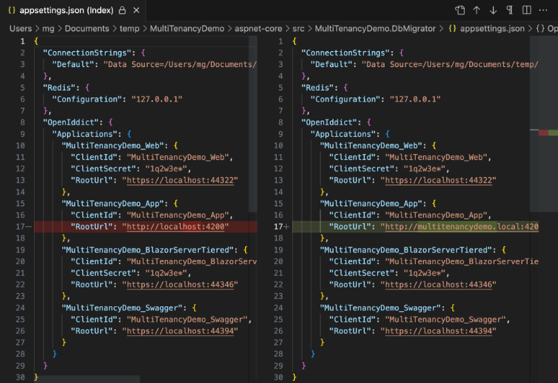
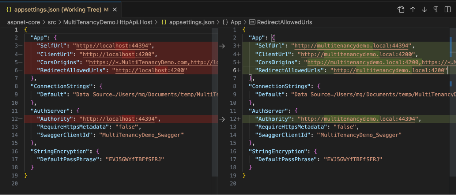

# How to use domain-based tenant resolver in ABP with Angular and OpenIddict

## Step 1: Create ABP App

Use the following command to create an example ABP app named "MultiTenancyDemo" with the app template (open source version of ABP). Note that all the steps provided here can also be applied to the commercial version (-t app-pro) of ABP.

```bash
> abp new MultiTenancyDemo -t app -u angular --mobile none --database-provider ef -dbms SQLite --create-solution-folder --version 7.3.2
```
This command will set up the foundation of your app with the specified options. 


## Step 2: Configure HTTP for Local Development (Optional)

If you're running the app locally with a local domain, using HTTP instead of HTTPS can be beneficial for a few reasons:
- Simplified Local Demonstration: For the purpose of this example, the app is demonstrated in a local environment. Deploying to a platform might complicate the demonstration.
-  Mitigating SSL Challenges: Configuring HTTPS with a custom local domain (e.g., multitenancydemo.local) can often trigger SSL-related issues due to the absence of valid SSL certificates. Opting for HTTP circumvents these potential challenges and allows for smoother testing in a local environment.

Due to these considerations, if you are using a domain-based tenant resolver on a remote server, you can skip Step 2.

- Navigate to the Angular app folder.
- Locate the environment.ts file.
- Modify the URLs from HTTPS to HTTP to match the local environment.
- Additionally, change the oAuthConfig.requireHttps setting to false to allow HTTP connections for OAuth:

 

 These adjustments ensure that the app functions properly over HTTP when using a local domain.

 - 	Navigate to the path aspnet-core/src/MultiTenancyDemo.HttpApi.Host/Properties/launchSettings.json within your project directory.
- Open the launchSettings.json file in property folder of host project.
-	Locate the URL settings under the profiles section. Change the protocol from HTTPS to HTTP. For example, if it was "applicationUrl": "https://localhost:44367", modify it to "applicationUrl": "http://localhost:44367".

## Step 3: Configure OpenIddict Server (Optional)

Note: Starting from ABP version 6.0, the default authentication solution is OpenIddict. However, if you're using an alternative authentication server,  However, if you're not working with HTTP or OpenIddict, you can omit this step.

-	Navigate to the YourProjecNameHttpHostModule file within your project. This file is commonly located in the aspnet-core/src/YourProjectName.HttpApi.Host directory.
-	Inside the PreConfigureServices section of the file, incorporate the provided code snippet to configure OpenIddict settings:

```csharp
#if DEBUG
PreConfigure<OpenIddictServerBuilder>(options => {
    options.UseAspNetCore().DisableTransportSecurityRequirement();
});
#endif
```

 

Your backend app now operates over HTTP, making local testing and demos smoother. Let's proceed to the next step in implementing the domain-based tenant resolver in ABP with Angular and OpenIddict. Please share the next step, and I'm here to help you proceed.

## Step 4: Set Up Local Domains (Optional)

If you'd like to set up local domains for your app. You can follow the steps below. If you're not using local domains, you can skip this step.

- Edit your host file. On Mac OS, you can find it at /etc/hosts. Add the following lines:
```
127.0.0.1    multitenancydemo.local
127.0.0.1    odin.multitenancydemo.local
```
- In your Angular app, open the package.json file. Add the following parameters to the "start" script:
```
{
    "scripts": {
        "start": "ng serve --open --host 0.0.0.0 --disable-host-check"
    }
}
```

This allows your app to be served on all available network interfaces and disables host checks. This is necessary for the app to be served on a local domain.

Proceed to your Angular app's environment.ts file. Adjust the URLs to employ the http:// scheme and the tenant pattern. For instance, if you're utilizing a subdomain-based pattern like http://{0}.multitenancydemo.local, the change would appear as follows:

 

 - Navigate to aspnet-core/src/YourProjectName.DbMigrator/appsettings.json. Edit the yourappname_app:rootUrl setting. Update it to reflect your custom domain:
 

 - Similarly, go to aspnet-core/src/YourProjectName.HttpApi.Host/appsettings.json. Edit the settings:
    
    By making these changes, your app is now ready to use the custom domain name 'Multitenancydemo.local.' This prepares the foundation for developing a domain-based tenant resolver in ABP with Angular and OpenIddict.

## Step 5: Configure Domain Format for OpenIddict

- Open the YourProjecNameHttpHostModule file within your host project. (This file is located in the aspnet-core/src/YourProjectName.HttpApi.Host directory.)

- add the namespace  `using Volo.Abp.OpenIddict.WildcardDomains;`
- add the code:
```csharp
PreConfigure<AbpOpenIddictWildcardDomainOptions>(options =>
{
    options.EnableWildcardDomainSupport = true;
    options.WildcardDomainsFormat.Add("http://{0}.multitenancydemo.local");
});
```


## Step 7: Configure Tenant Resolver Format

- Open the YourProjecNameHttpHostModule file within your host project.
- Go to ConfigureServices method and add the code:
```csharp
   Configure<AbpTenantResolveOptions>(options =>
        {
            options.AddDomainTenantResolver("{0}.multitenancydemo.local");
        });
```
## Step 8: Add Tenant
- Go to menu and open Tenant Management.
- Add a Tenant with name "Odin" or what do you want.

## Step 9: Testing the Configuration
Let's put your setup to the test:

Begin by creating a tenant through the user interface.

- Visit the URL format: http://{tenantName}.multitenancydemo.local:4200 in your browser. For example, if your tenant name is Odin, the URL would be http://odin.multitenancydemo.local:4200.
- Click the login button on home page. 
- Proceed to log in using your tenant's password. You should now be logged in as a user of the Odin tenant.
- It should be logged in as a user of the Odin tenant.


If everything is working as intended, you should find that the application functions seamlessly, just as it would without selecting a tenant. This confirms the successful implementation of the domain-based tenant resolver. 
The complete source code for this tutorial can be found in the https://github.com/mahmut-gundogdu/ABP-Domain-based-Tenant-Example

Feel free to explore the codebase for a comprehensive understanding of how the domain-based tenant resolver is implemented in ABP with Angular and OpenIddict.

Should you need any further assistance, I'm here to help.

